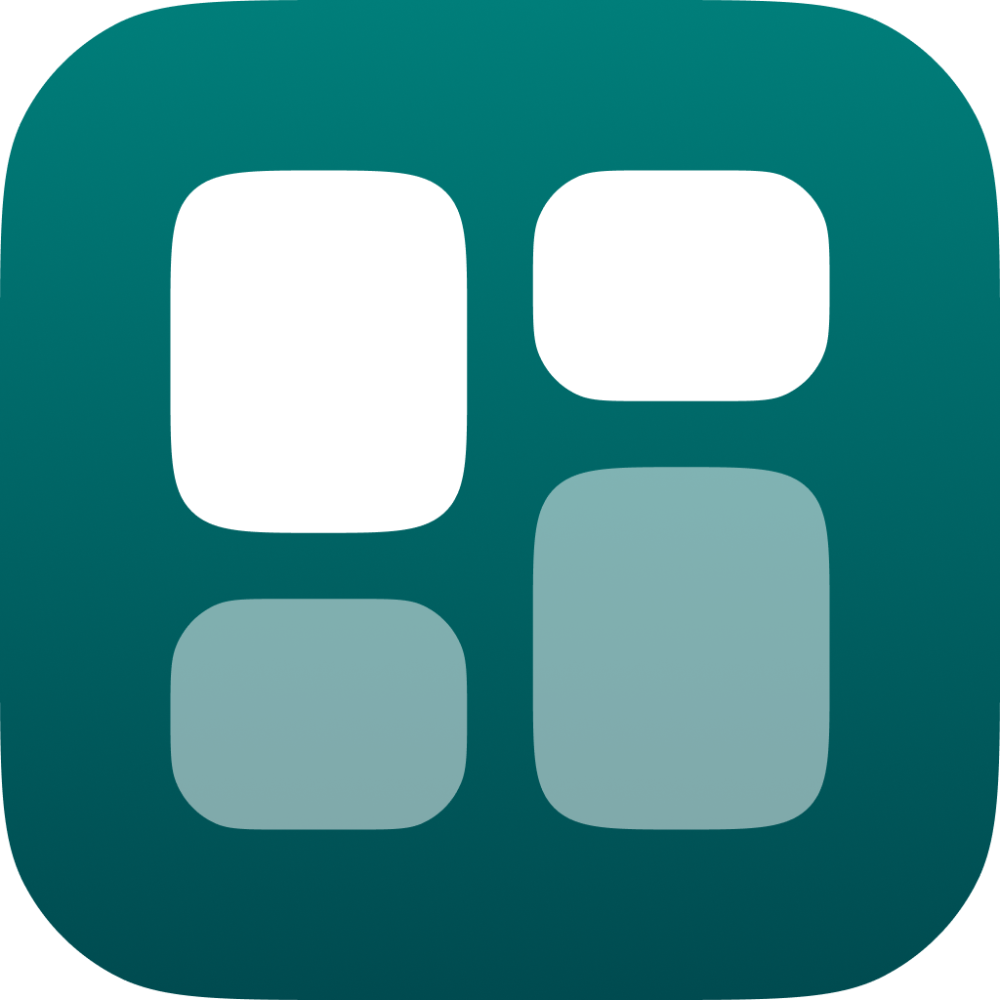

[ Brazilian Portuguese](README.md)

# QuadroFlow | Desktop & Web

Desktop and Web app | A visual organization application that combines the
simplicity of the Kanban board with the fluidity of an agile workflow.

## 📦 Technologies

* [Dart](https://dart.dev/)
* [Flutter](https://flutter.dev/)

## 🖥️ Platforms

* macOS (>=11.5) 🟡
* Windows (>=10.0) ✅
* Linux (debian-based) 🟡
* Web (any modern browser) ✅

## 🧑‍💻 Contributing

🚫 This project is not accepting external contributions at the moment while
core development is still in progress. Stay tuned for updates!

## 📜 Credits

* SoftYes TI [\<softyes.com.br\>](https://softyes.com.br)
* João Sereia [\<joao.sereia@softyes.com.br\>](mailto:joao.sereia@softyes.com.br)
